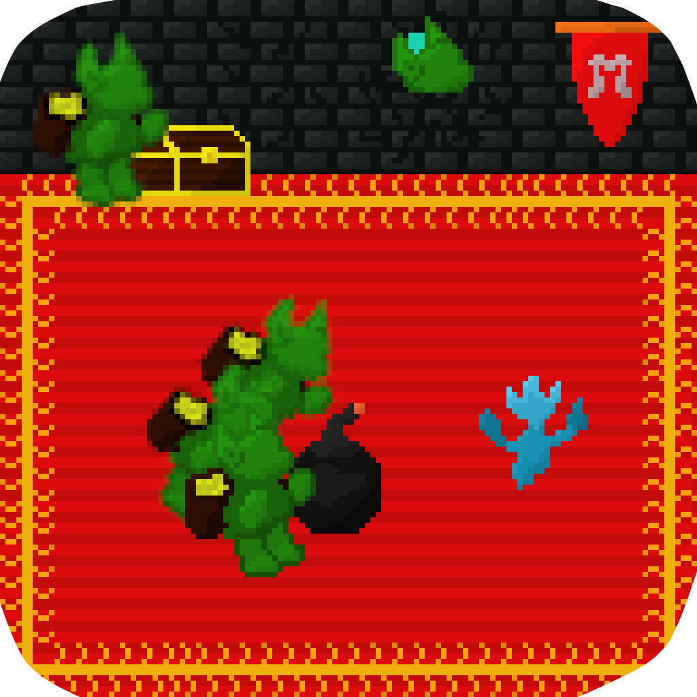

# Accueil
Bonjour, je me présente, moi c'est **Dylan** !

J'étudie actuellement à l'**école d'ingénieurs du CESI** et réalise quelques **projets informatiques** sur mon temps libre.  Ce site sert justement à avoir une **présentation concise** de certains projets jugés "présentables".

J'aime énormément tout ce qui est lié à l'**univers de la création**. C'est certes assez vaste, mais cela représente aussi l'étendu de ma **curiosité** ! 
C'est en découvrant Unity à l'âge de 14 ans que j'ai réellement commencé à me lancer plus sérieusement sur mes passions : **créations de jeux vidéos**, d'**animations** et maintenant de **livres**, je m'épanouis dans ce monde infini de l'imaginaire.
  

## Jeux
Voici donc une liste non-exhaustive de jeux-vidéos que j'ai réalisés :

  
  
  

  
  
  

  

## Fin
C'est la fin !
