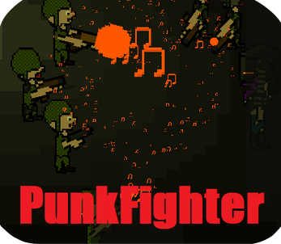
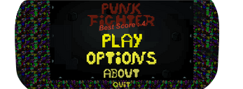
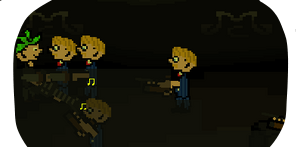
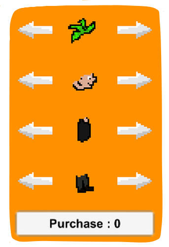

# PunkFighter

  À l'occasion d'une **game jam** datant de mars 2020, je me suis lancé dans la création d'un jeu sur le thème "punk". Mon objectif était d'être capable de créer un jeu dans un **laps de temps limité**, car je participais à ma première game-jam en ligne. 
  
  Vous pouvez retrouver le jeu sur itch.io en cliquant [ici](https://mcdown.itch.io/punkfighter).
  
  Dans celui-ci, il est question de **repousser des vagues** de punks sur une scène à l'aide d'une guitare qui se **charge en son**. Il y a différents types d'ennemis qui se battent dans des styles différents (corps à corps ou à distance). Il est également possible de personnaliser le joueur à l'aide de points gagnés à chaque partie.
  

## Informations
- **Moteur de jeu :** Unity 2D
- **Type :** TPS
- **Status :** Fini
- **Assets Utilisées :** Effets sonores, musique et joysticks
- **Durée de réalisation :** 10 jours
- **Plateformes :** Windows, Mac, Linux, Android
  

## Présentation
  Voici quelques images extraites du jeu :
  

    
    
    
  

 

    
<a href="./rocknfall.html">Retour</a>

    
<a href="./index.html">Accueil</a>

    
<a href="./soulinthecastle.html">Projet suivant</a>

