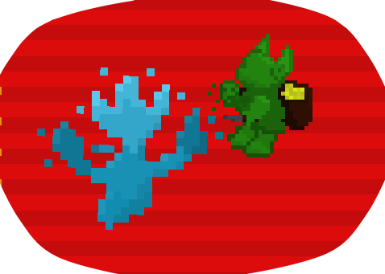
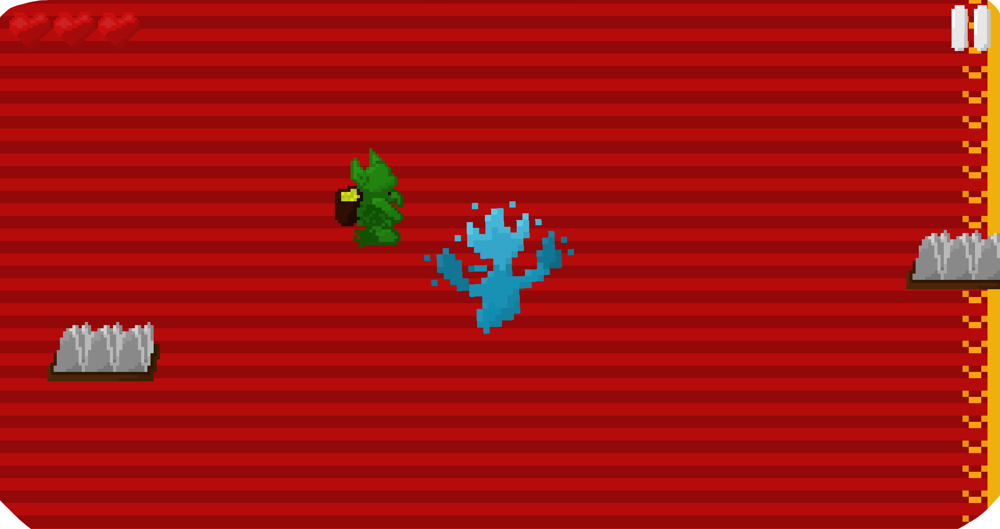
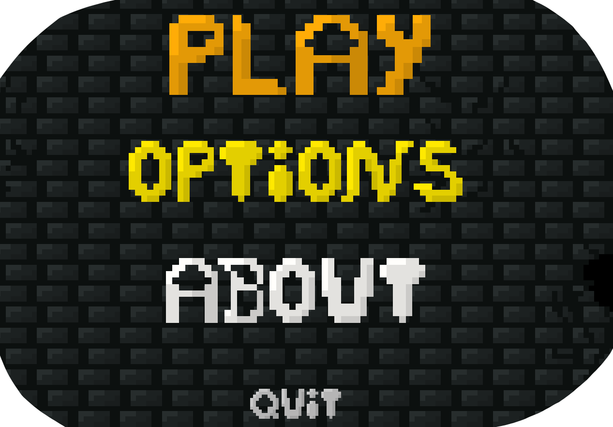

# SoulInTheCastle

  À l'occasion d'une **game jam** organisée par le vidéaste francophone "Tuto Unity FR" datant de mai 2020, je me suis lancé dans la création d'un jeu sur le thème "Les dés sont jetés". Vous pouvez le retrouver sur [itch.io](https://mcdown.itch.io/soul-in-the-castle).
  
  Dans celui-ci, il est question de **repousser des vagues** de goblins assiégeant le château d'une âme errante. Cependant, le joueur ne peut pas se débarasser de ses ennemis par lui-même : il doit les **guider vers des pièges** pour s'en débarasser.
  

## Informations
- **Moteur de jeu :** Unity 2D
- **Type :** STR en vue TPS
- **Status :** Fini
- **Assets Utilisées :** Effets sonores et joysticks
- **Durée de réalisation :** 2 jours
- **Plateformes :** Windows, Mac, Linux, Android
  

## Présentation
  Voici quelques images extraites du jeu :
  

    
    
  

  

    
    
  

 

    
<a href="./punkfighter.html">Retour</a>

    
<a href="./index.html">Accueil</a>

    
<a href="./ratattack.html">Projet suivant</a>

