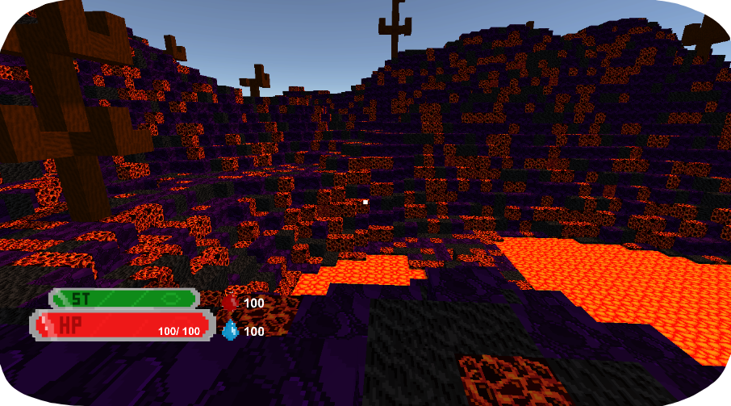
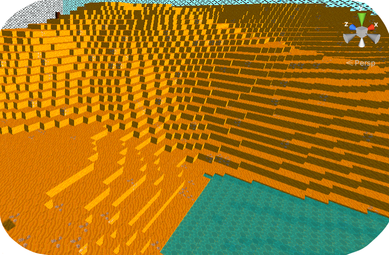
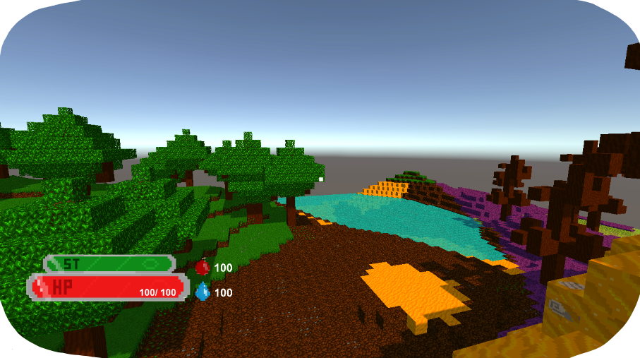
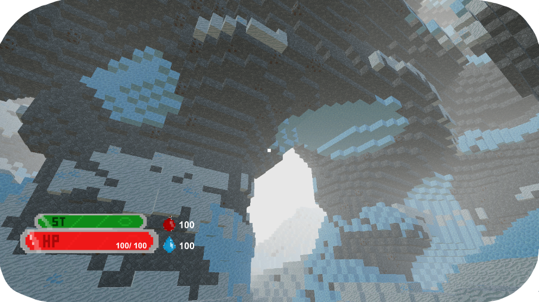
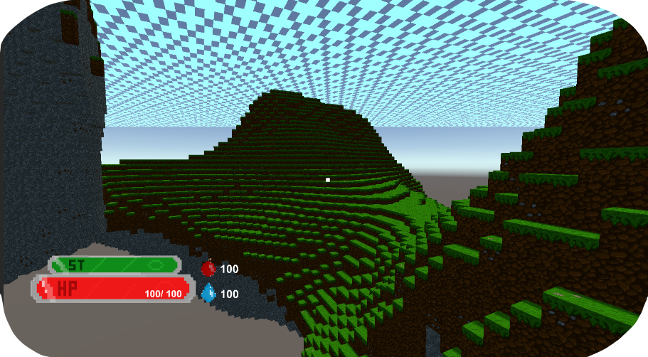
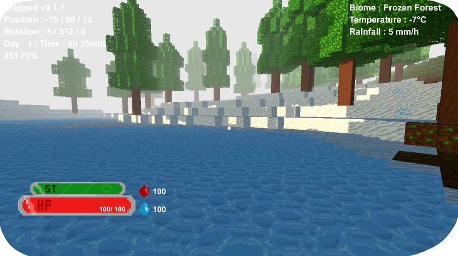
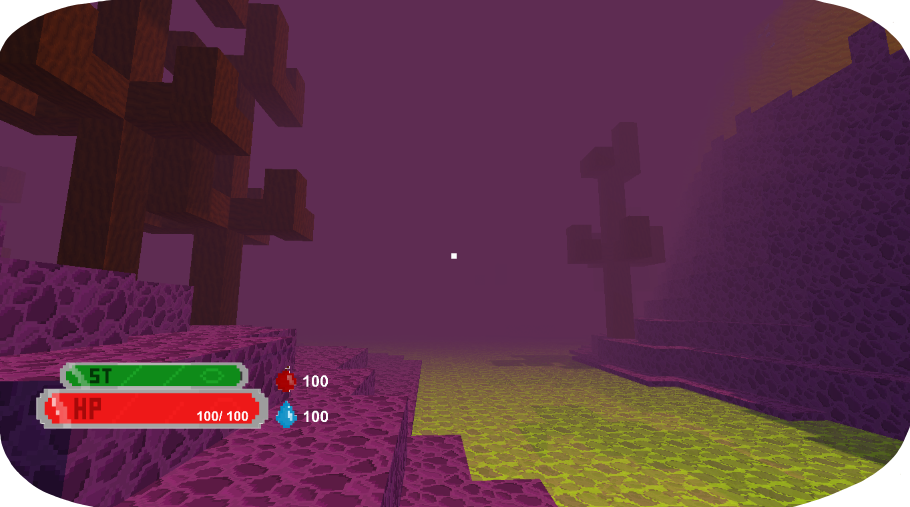
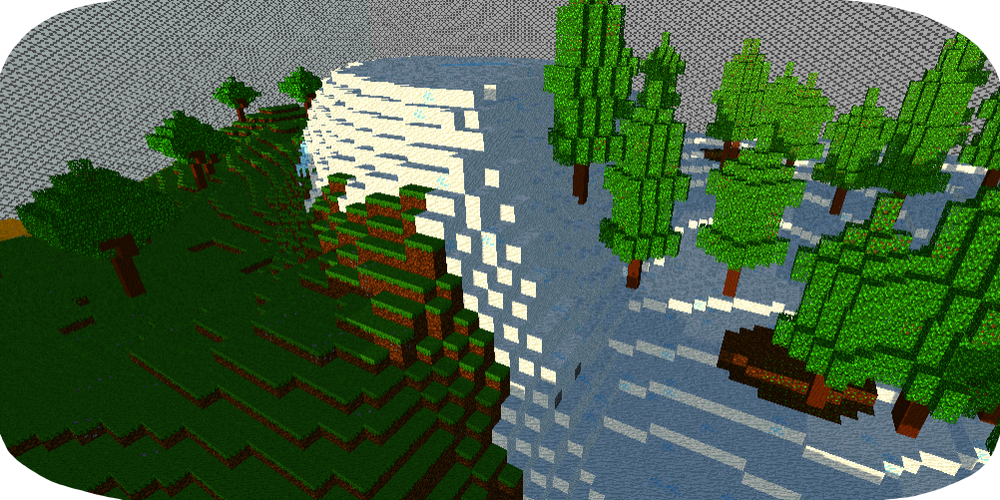

# Trapped

  Ce jeu est le plus gros projet sur lequel j'ai pu travailler jusqu'à présent. Il représente **2 ans** de développement, que ce soit dans la rédaction d'un [Game Design Document](https://docs.google.com/document/d/1_1KQkmH81AEaGpWc58F0cResZkfwV0hweFI6ZmrWNoI/edit?usp=sharing) ainsi que dans la réalisation du projet, disponible dans sa dernière version sur [itch.io](https://mcdown.itch.io/trapped).

  Cependant, il est aussi la **réalisation personnelle de mon manque d'expérience**. En effet, je me suis lancé dans un tel projet à l'âge de 15 ans, immédiatement après avoir réalisé mon premier jeu. Cela m'a certes apporté énormément de connaissance en terme d'**organisation**, de **technique de programmation** et d'**assiduité**, mais cela m'a également mis face à la réalité : j'étais incapable d'optimiser un tel programme.

  Je vous présente alors humblement ce projet, en temps que plus grande fierté, mais en toute humilité.
  

## Informations
- **Moteur de jeu :** Unity 3D
- **Type :** Sandbox
- **Status :** Abandonné
- **Assets Utilisées :** Aucune
- **Durée de réalisation :** 2 ans
- **Plateformes :** Windows, Mac, Linux.
  

## Génération Procédurale
  Comme le jeu dont est fortement inspiré ce projet, le monde composé de **voxels** est généré **procéduralement**, à l'aide du *Bruit de Perlin*. Le tout est entièrement déterminé par une **graine de génération** et est ensuite **sauvegardé** automatiquement.

  <video src="./Videos/GenerationProcedurale.mp4" type="video/mp4" controls></video>

  

## Environnement
  Dans ce jeu, nous étions censé incarner un alien recherchant des planètes habitables pour la survie de son espèce dont le vaisseau s'est écrasé sur Terre. Étant vous-mêmes humain, vous serez intrigués d'apprendre pourquoi il ne reste qu'un **espace limité par un champs de force**, l'humanité est revenue à **l'âge de pierre** et pourquoi **certains évènements rendent toutes les créatures follent**...

  Au stade actuel du développement, je n'ai pu créer ce qu'on appelle des "**biomes**", qui représentent des environnements types. Il y en a un total de 9, possédant chacun des **souterrains** mais aussi des **îles flottantes** uniques.

  
  
  

 
  Exemples de caves et d'îles flottantes :

  
  

 
  Il y a aussi un système d'**ambiance** qui ajoute un brouillard dans certaines zones :

  
  

 
  Et enfin, chaque biome ayant un terrain différent, il y a une gestion des transitions entre ceux-ci :

  

  

## Interactions
  eee
