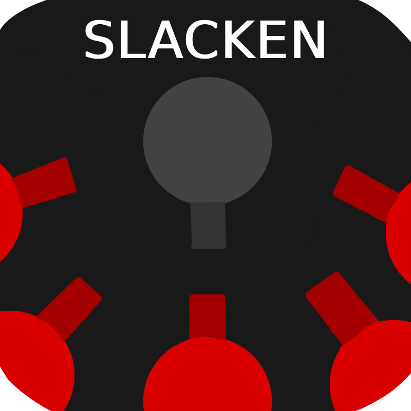

# Trapped

Ce jeu est le plus gros projet sur lequel j'ai pu travailler jusqu'à présent. Il représente **2 ans** de développement, que ce soit dans la rédaction d'un [Game Design Document](https://docs.google.com/document/d/1_1KQkmH81AEaGpWc58F0cResZkfwV0hweFI6ZmrWNoI/edit?usp=sharing) ainsi que dans la réalisation du projet, disponible dans sa dernière version sur [itch.io](https://mcdown.itch.io/trapped).

Cependant, il est aussi la **réalisation personnelle de mon manque d'expérience**. En effet, je me suis lancé dans un tel projet à l'âge de 15 ans, immédiatement après avoir réalisé mon premier jeu. Cela m'a certes apporté énormément de connaissance en terme d'**organisation**, de **technique de programmation** et d'**assiduité**, mais cela m'a également mis face à la réalité : j'étais incapable d'optimiser un tel programme.

Je vous présente alors humblement ce projet, en temps que plus grande fierté, mais en toute humilité.
  

## Informations
- **Moteur de jeu :** Unity 3D
- **Type :** Sandbox
- **Status :** Abandonné
- **Assets Utilisées :** Aucune
- **Durée de réalisation :** 2 ans
- **Plateformes :** Windows, Mac, Linux.
  

## Génération Procédurale
Comme le jeu dont est fortement inspiré ce projet, le monde composé de **voxels** est généré **procéduralement**, à l'aide du bruit de Perlin. Le tout est entièrement déterminé par une **graine de génération** et est ensuite sauvegardé automatiquement.
<video width="720" height="480" controls>
  <source src="./Videos/GenerationProcedurale.mp4" type="video/mp4">
</video>

## Temp Test
Voici un lien vers une [autre page](./trapped.md).

Ceci est un tableau :
| cellule 1| cellule 2|
|:---------|---------:|
| ABC      | B        |
|    C     |    D     |

Ceci est une phrase. \n Ceci est une phrase après un saut de ligne.

Dans le texte ordinaire[^1] vous pouvez facilement placer des notes de bas de page[^2]

Voici une image à regarder : 

<video width="320" height="180" controls>
  <source src="./Videos/TrailerRock'n'Fall.mp4" type="video/mp4">
</video>

Ceci est une preuve de mise à jour 2.

[^1]: Vous trouverez ici le texte de la note de bas de page.
 [^2]: **Note de page de page** peut aussi être *formatée*.
Et celles-ci comprennent même plusieurs lignes
